<p align="center">
  
</p>

<h1 align="center">Tandem</h1>

<p align="center">
  
  
  
  
</p>

Tandem is a lightweight expense-splitting app for partners. Create profiles, log expenses or income, and keep track of who paid what with clear splits and monthly filters.

## What it does
- Track shared expenses, income, and liquidation payments.
- Split expenses by custom percentages or default profile splits.
- Review transactions with filters for month, type, and category.
- Manage partner profiles and default split percentages.

## Screenshots
<details>
<summary>Desktop</summary>

**Add transaction (1)**
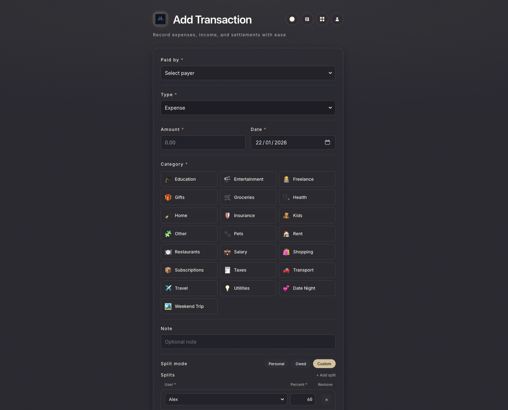

**Add transaction (2)**
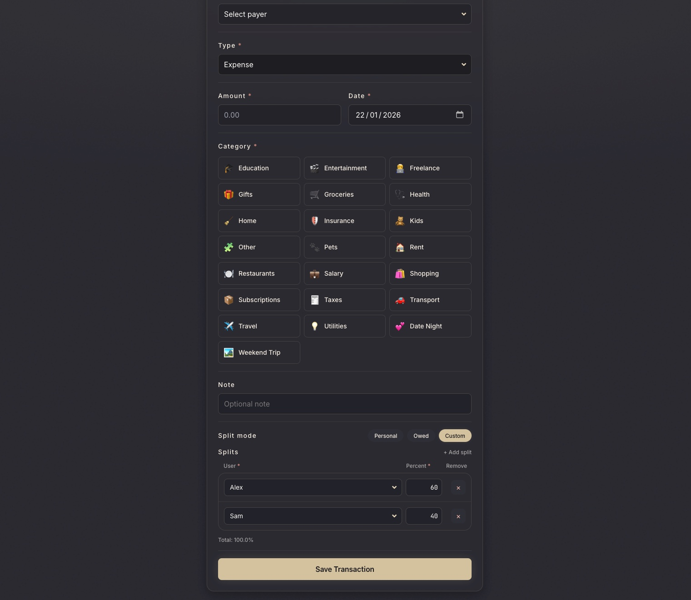

**Categories**
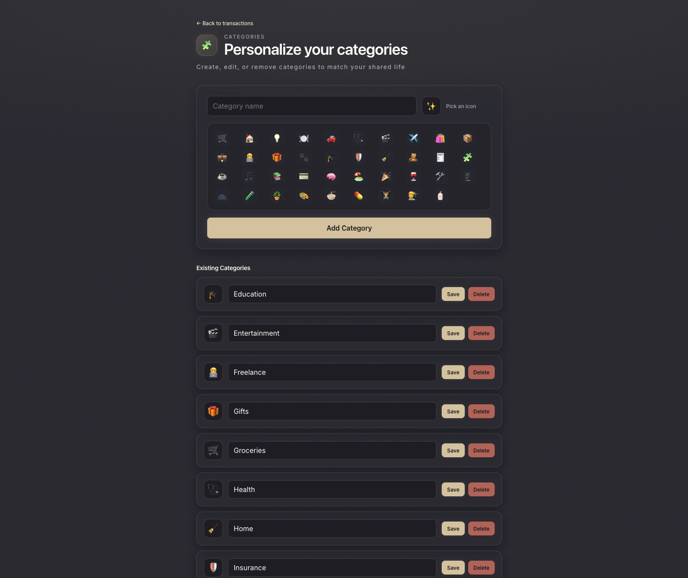

**Profiles**
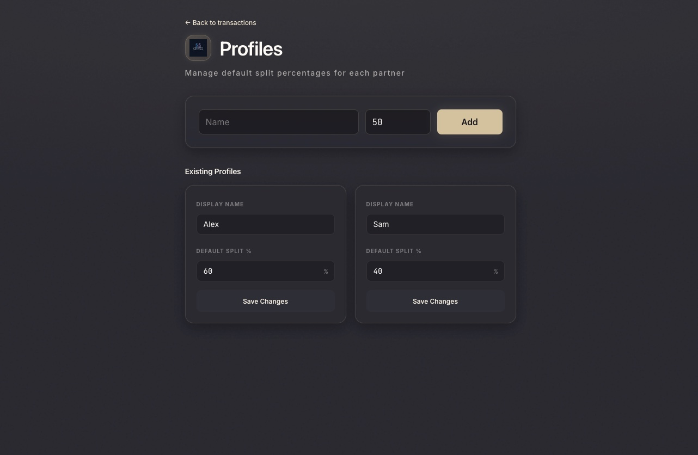

**Timeline**
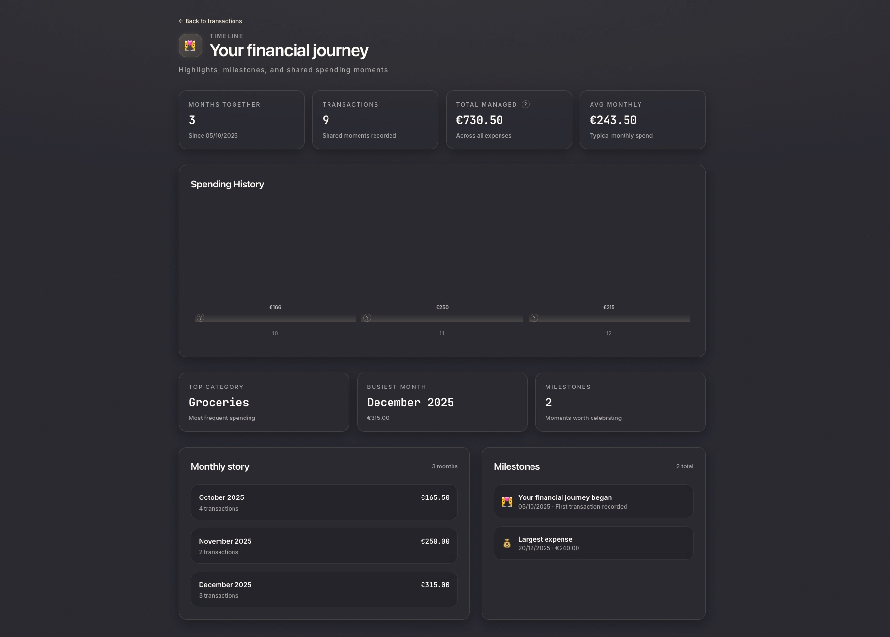

**Transactions (1)**
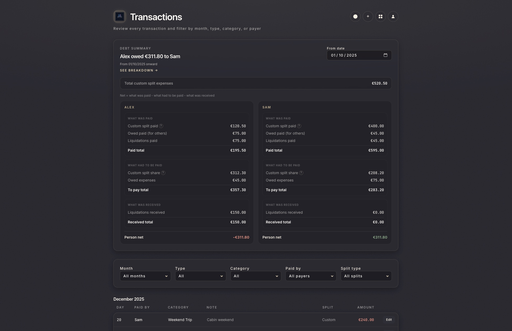

**Transactions (2)**
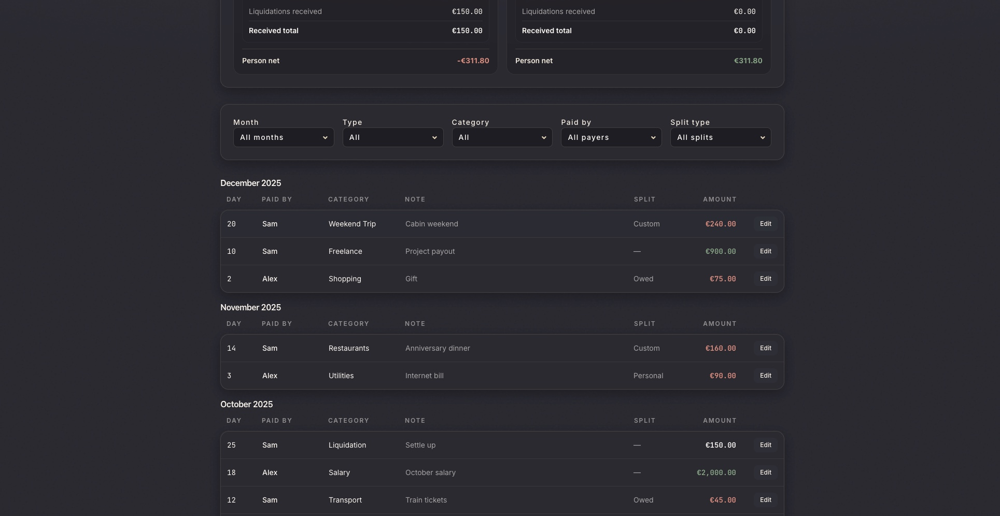

**Transactions edit**
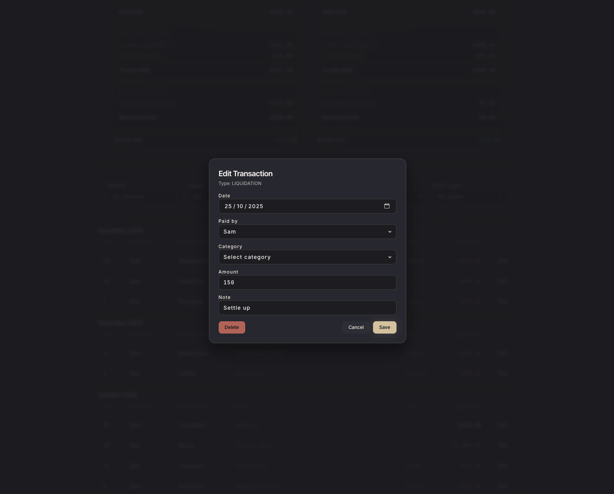
</details>

<details>
<summary>Mobile</summary>

**Add transaction (1)**
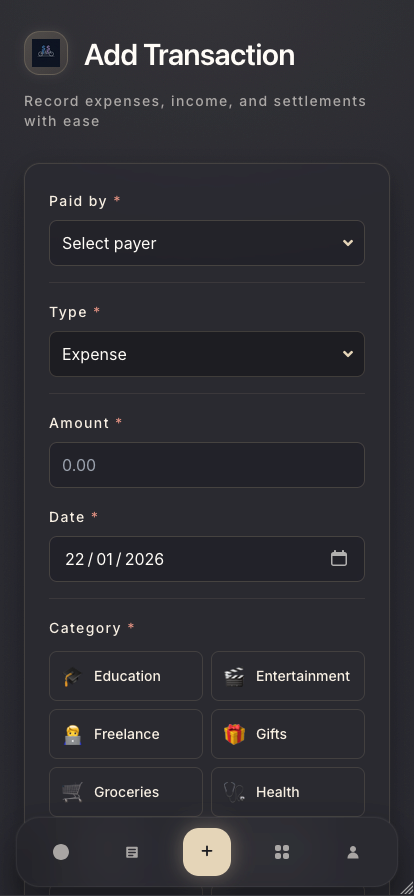

**Add transaction (2)**
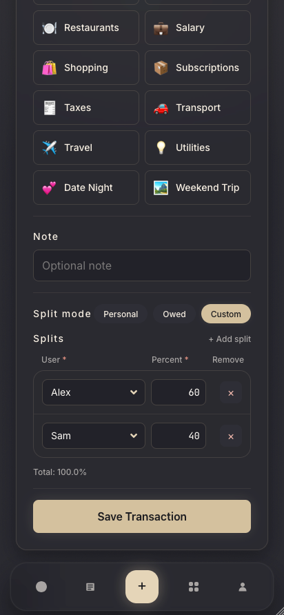

**Categories**
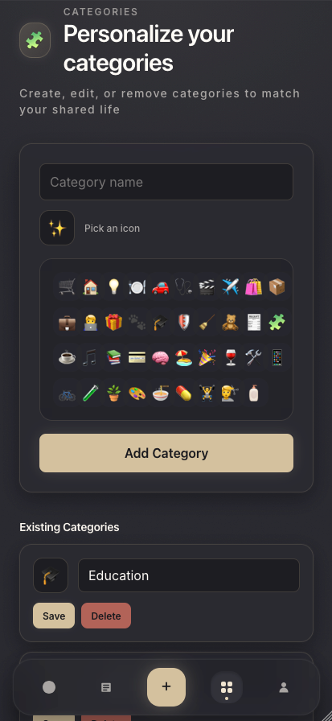

**Profiles**
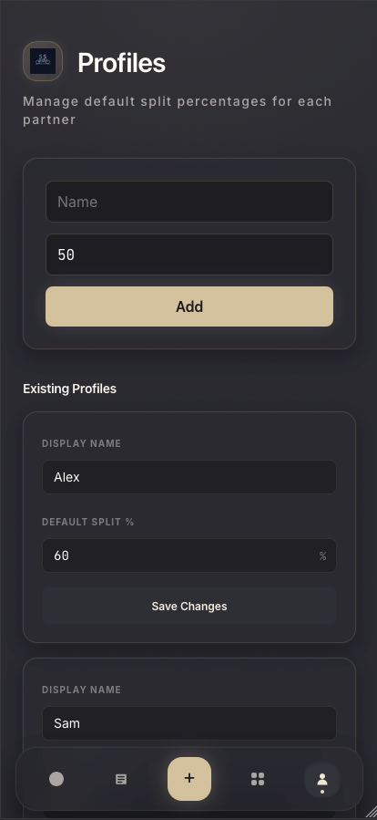

**Timeline (1)**
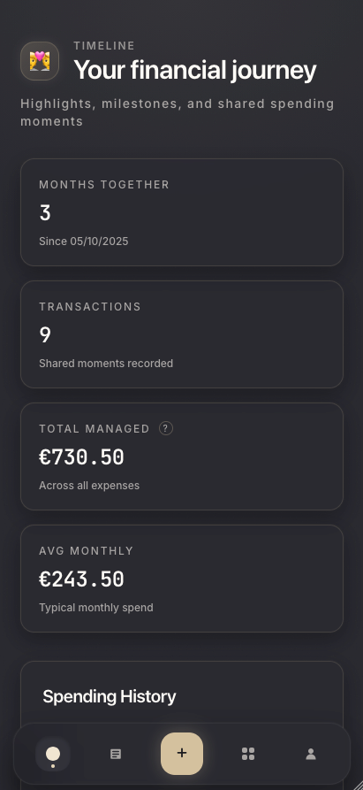

**Timeline (2)**
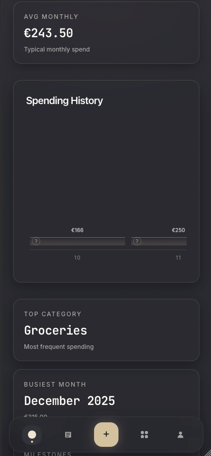

**Timeline (3)**
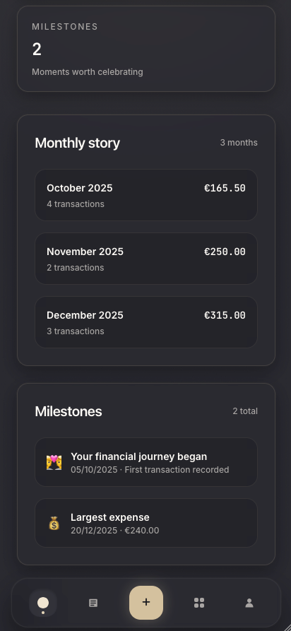

**Transactions (1)**
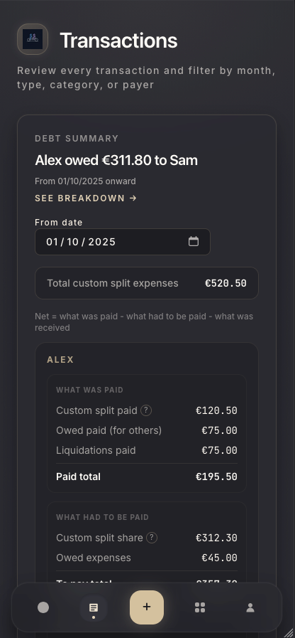

**Transactions (2)**
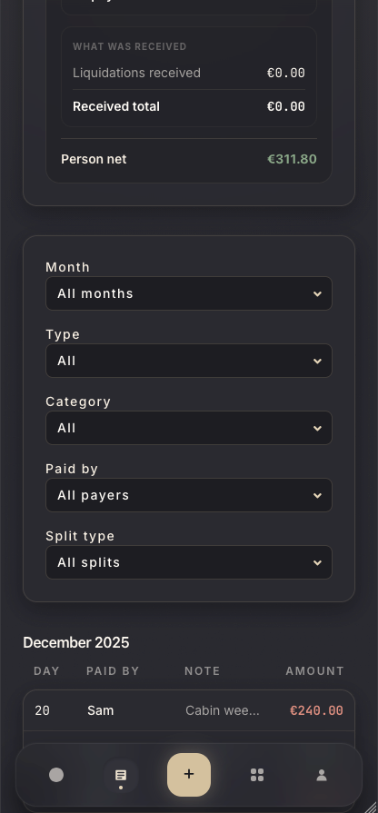

**Transactions (3)**
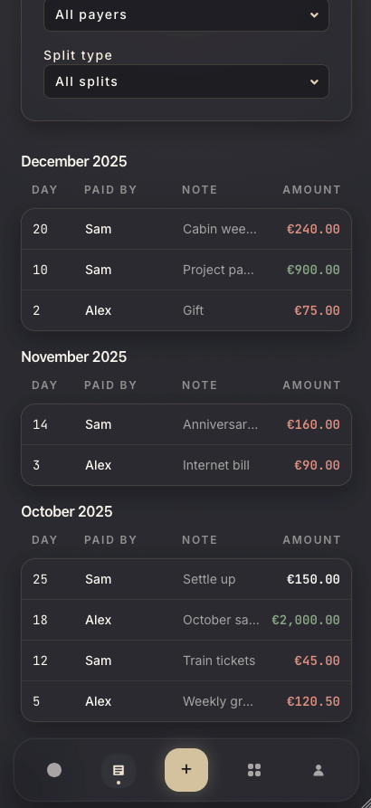
</details>

## Setup
### Prerequisites
- Bun installed.
- A Supabase project with the tables used by the backend.

### Supabase schema
Run `apps/backend/sql/schema.sql` in the Supabase SQL editor to create the full schema and default categories.

### Environment variables
Create a `.env` file in the repo root with:

```
SUPABASE_URL=your_supabase_url
SUPABASE_SERVICE_ROLE_KEY=your_service_role_key
SUPABASE_ANON_KEY=your_anon_key
```

For local dev without Docker, also set:
- Backend: `SUPABASE_URL`, `SUPABASE_SERVICE_ROLE_KEY` in your shell env
- Frontend: `API_BASE_URL=http://localhost:4000` (for example in `apps/frontend/.env.local`)

### Run with Docker Compose
```
docker compose up --build
```

This starts:
- Frontend: `http://localhost:3000`
- Backend API: `http://localhost:4000`

### Run without Docker
Start the backend:

```
cd apps/backend
bun install
bun dev
```

Start the frontend in a separate terminal:

```
cd apps/frontend
bun install
bun dev
```

## Using the app
1. Open `http://localhost:3000`.
2. Go to Profiles and create partner profiles with default split percentages.
3. Return to the home screen to add a transaction:
   - Choose the type (Expense, Income, or Liquidation).
   - Fill in payer/recipient, amount, date, and category.
   - For expenses, choose split mode and set custom percentages if needed.
4. Visit Transactions to review and filter by month, type, or category.

## Transaction types
- Expense: A shared cost that can be split by custom percentages.
- Income: Money received by a partner (no split required).
- Liquidation: A transfer to settle up with the other partner.

## API overview
The frontend proxies requests through `/api/...` using `API_BASE_URL` (defaults to `http://localhost:4000`). The backend stores data in Supabase tables `profiles`, `transactions`, `transaction_splits`, and `categories`.
